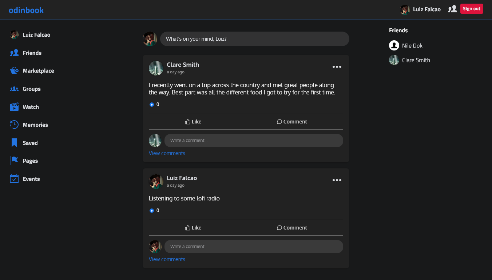
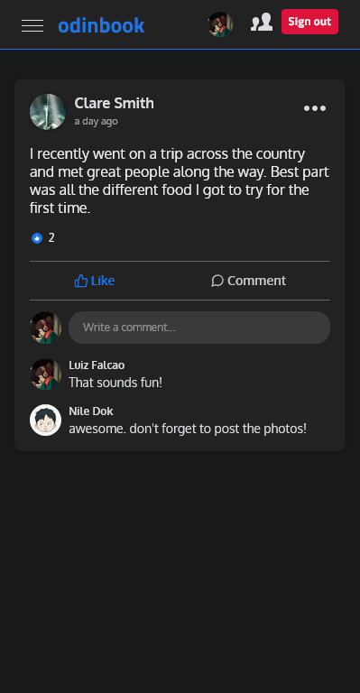
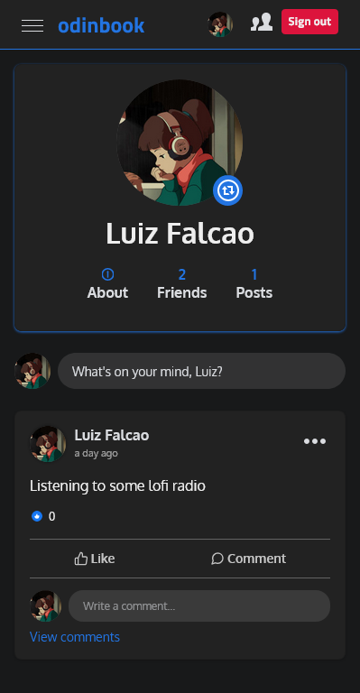

# Odinbook

The last NodeJS project in [The Odin Project](https://www.theodinproject.com/paths/full-stack-javascript/courses/nodejs/lessons/odin-book) course. A social network allowing users to make posts and add friends.

Frameworks and tools: React, NodeJS, Express, and MongoDB.

  
  

