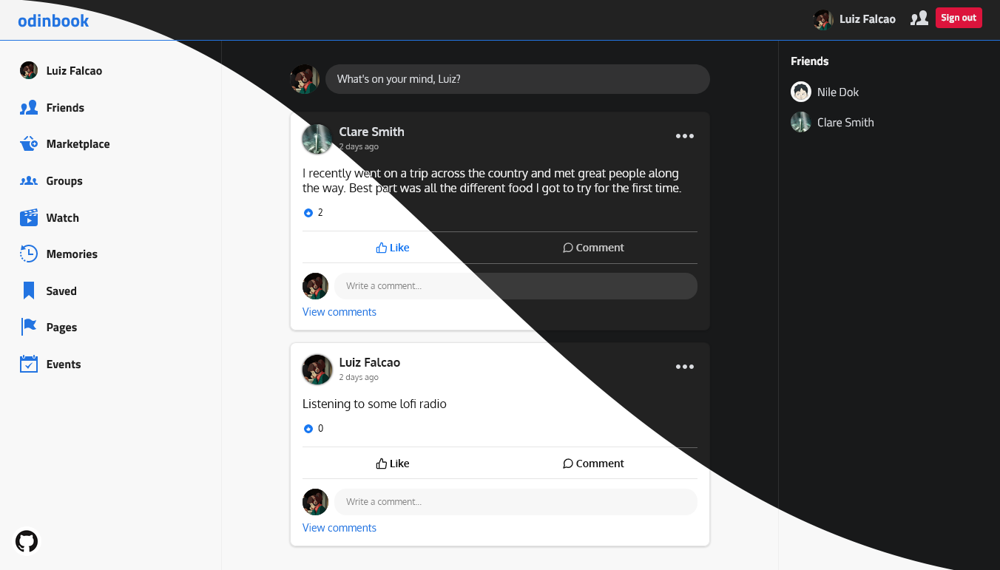

# Odinbook

The last NodeJS project in [The Odin Project](https://www.theodinproject.com/paths/full-stack-javascript/courses/nodejs/lessons/odin-book) course. A social network allowing users to make posts and add friends. [Available here.](https://llfalcao.github.io/odinbook/)

The backend is hosted on Heroku, so there might be a small delay until the app wakes up and gets the API running.

Project made using the MERN stack: MongoDB, Express, React, and NodeJS.

#### **Home (theme follows the system default)**

  
  

